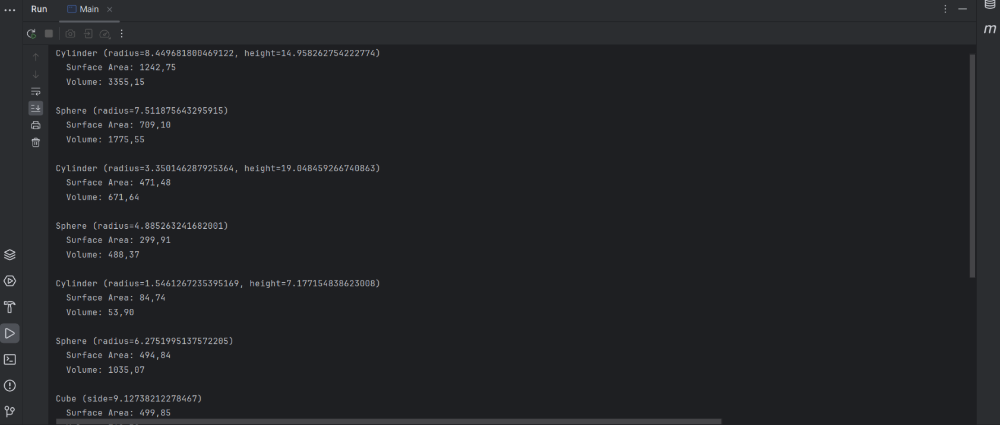
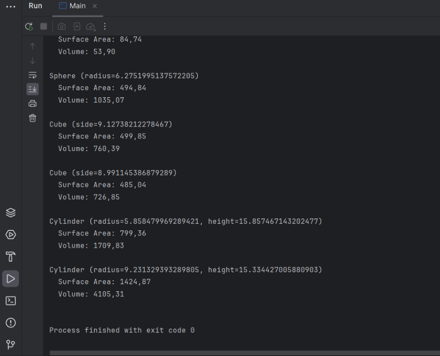

# 3D Shapes Project - README

## Project Overview

This project demonstrates the concept of polymorphism in Java through the design of a system that computes the surface area and volume for different 3D shapes. The implementation consists of the following key components:

- **Shape3DInterface**: An interface that establishes the contract for 3D shapes.
- **Shape Classes**: Specific 3D shape classes (Sphere, Cylinder, and Cube) that implement the interface, each providing its own logic for the calculation methods.
- **Main Program**: A driver program that creates random instances of these shapes and computes their surface area and volume.

## Key Components

### Shape3DInterface

The `Shape3DInterface` defines two essential methods:

- `surfaceArea()`: Calculates the surface area of the shape.
- `volume()`: Calculates the volume of the shape.

### 3D Shape Classes

Each shape class implements the `Shape3DInterface` and provides specific implementations of the `surfaceArea` and `volume` methods.

#### Sphere

- **Constructor**: Takes the radius of the sphere.
- **Surface Area Formula**:
- **Volume Formula**:

#### Cylinder

- **Constructor**: Takes the radius and height of the cylinder.
- **Surface Area Formula**:
- **Volume Formula**:

#### Cube

- **Constructor**: Takes the side length of the cube.
- **Surface Area Formula**:
- **Volume Formula**:

### Main Program

The `Main` class creates 10 random instances of 3D shapes (Sphere, Cylinder, and Cube) and stores them in a list. For each shape, the program calculates and displays:

- The type and dimensions of the shape.
- The surface area of the shape.
- The volume of the shape.

Random values for the dimensions are generated within specific ranges to ensure variety across the shapes.

### Polymorphism

Polymorphism is a core aspect of this project, allowing the program to handle different types of shapes in a uniform way:

- **Interface Implementation**: Each shape class implements the `Shape3DInterface`, ensuring that each class provides methods to calculate the surface area and volume. This guarantees consistency across different shape types.

- **Dynamic Method Dispatch**: In the main program, a list of `Shape3DInterface` references stores instances of the `Sphere`, `Cylinder`, and `Cube` classes. When calling `surfaceArea` or `volume` on each object, the appropriate method is invoked based on the object's runtime type.

This design makes the system flexible, allowing easy extension by adding new 3D shapes without altering the existing codebase. The use of polymorphism ensures the program adheres to object-oriented principles, promoting scalability and maintainability.

---

